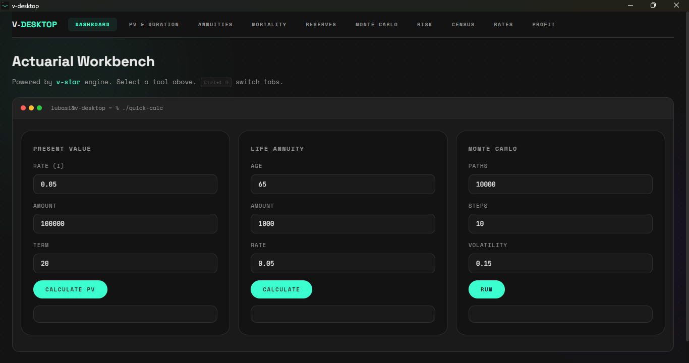

<p align="center">
  
</p>

<h1 align="center">v-desktop</h1>

<p align="center">
  <b>Desktop actuarial workbench</b><br>
  Powered by <a href="https://github.com/lubasinkal/v-star">v-star</a>
</p>

<p align="center">
  <a href="https://github.com/lubasinkal/v-desktop/actions/workflows/build.yml">
    
  </a>
  <a href="https://github.com/lubasinkal/v-desktop/releases/latest">
    
  </a>
  <a href="LICENSE">
    
  </a>
  <a href="https://img.shields.io/badge/Go-1.26+-00ADD8?logo=go">
    
  </a>
</p>

<p align="center">
  <a href="https://github.com/lubasinkal/v-desktop/releases/latest">
    
  </a>
  <a href="https://github.com/lubasinkal/v-desktop/releases/latest">
    
  </a>
  <a href="https://github.com/lubasinkal/v-desktop/releases/latest">
    
  </a>
</p>

---

## Overview

v-desktop replaces the spreadsheet-and-VBA workflow with a native desktop application that covers the full actuarial toolkit. Present values, annuities, mortality tables, reserves, Monte Carlo simulations, risk metrics, census processing, and profit testing — all running locally on the [v-star](https://github.com/lubasinkal/v-star) engine, no cloud required.

| Platform | Download |
|----------|----------|
| Windows | `v-desktop-windows-installer.exe` (installer) or `v-desktop-windows.exe` (portable) |
| macOS | `v-desktop-macos` |
| Linux | `v-desktop-linux` |

Grab the latest build from [Releases](https://github.com/lubasinkal/v-desktop/releases/latest).

---

## Features

### Dashboard
Quick-access calculators for present value, life annuity factors, and Monte Carlo summary — the most-used tools at your fingertips on launch.

### Present Value & Duration
Standard and v*-weighted present value, bulk PV, Macaulay and modified duration, convexity.

### Annuities
10 annuity types including whole-life (immediate, due), term (immediate, due), deferred term, net single premium, pure endowment, and approximation formulas.

### Mortality Tables
Browse built-in CSO 2017 male and female tables (ages 0–120). Query qx, px, lx, and curtate life expectancy. Chart mortality curves. Load custom tables from CSV.

### Reserves
Net premium reserve (NPR), gross premium reserve, prospective reserve (PV benefits − PV premiums), and retrospective reserve (recursive accumulation with mortality). All four methods produce identical results when the premium equals the net premium, confirming the Hattendorf identity.

### Monte Carlo
Geometric Brownian Motion and Vasicek mean-reverting interest rate simulations. Adjustable paths, time steps, drift, and volatility. Path visualization, terminal value distribution, and parameter sensitivity.

### Risk Metrics
Value-at-Risk (95%, 99%), Conditional Tail Expectation / Expected Shortfall (95%, 99%), confidence intervals, standard error.

### Census Processing
Process actuarial census CSV files with configurable parallelism. Streams large files without loading everything into memory. Outputs per-record present values and aggregate totals.

### Rate Converter
Convert between effective, nominal, and force-of-interest rates. Annuity-certain calculations.

### Profit Testing
Full profit-signature projection with annual premium, expenses (acquisition + renewal), commission schedule, and reserve emergence. Reports PV of profits, profit margin, IRR (Illinois algorithm), and discounted payback year. Profit signature bar chart.

---

## Screenshots


*Dashboard — quick calculators and system overview on launch.*

*Additional screenshots of individual tabs can be found in the project wiki.*

---

## Quick Start

```bash
# Prerequisites: Go 1.26+, Node 20+
go install github.com/wailsapp/wails/v2/cmd/wails@v2.12.0

git clone https://github.com/lubasinkal/v-desktop.git
cd v-desktop
wails dev
```

Opens the app in a native window with hot-reload on frontend changes.

### Build a Release Binary

```bash
wails build
# Output: build/bin/v-desktop (or v-desktop.exe on Windows)
```

Tagging a commit triggers the [CI workflow](.github/workflows/build.yml) which builds and releases Linux, Windows (with NSIS installer), and macOS binaries automatically.

---

## Architecture

```
v-desktop/
├── main.go                    # Entry point, Wails bootstrap, embeds mortality tables
├── app.go                     # App struct, wires 10 service backends, 29+ bound methods
├── wails.json                 # Wails project config
├── pkg/
│   ├── models/                # Shared request/response structs
│   └── services/              # 7 backends: rates, mortality, annuities, reserves,
│                              #   risk, stochastic, census, profit
├── frontend/
│   └── src/
│       ├── main.js            # SPA entry, tab registration, boot animation
│       ├── app.css            # Dark theme (800+ lines)
│       ├── lib/               # Tab navigation, Chart.js helpers
│       └── components/        # 10 tab component modules
├── tables/                    # Embedded CSO 2017 mortality CSV files
└── .github/workflows/         # CI: multi-platform build + GitHub Release on tag
```

### Built With

| Layer | Technology |
|-------|-----------|
| Desktop shell | [Wails v2](https://wails.io/) — Go + native WebView |
| Actuarial engine | [v-star](https://github.com/lubasinkal/v-star) v0.9.5 |
| Frontend | Vanilla JS, CSS3, HTML |
| Charts | [Chart.js](https://www.chartjs.org/) v4 |
| Bundler | [Vite](https://vitejs.dev/) v3 |
| Mortality tables | CSO 2017 Male & Female (embedded, ages 0–120) |

---

## Who It's For

| | |
|---|---|
| **Actuarial students** | Check manual calculations against a real engine. Build intuition by running what-if scenarios. |
| **Practicing actuaries** | Quick ad-hoc calculations without spinning up Excel or R. Process census files in seconds. |
| **Analysts** | Run simulations, query mortality tables, compute risk metrics — all from one desktop app. |
| **Developers** | Reference implementation of a production Wails + v-star application. Steal the patterns. |

---

## Roadmap

- [ ] CSV results export from census and profit tabs
- [ ] Scenario comparison (side-by-side parameter sets)
- [ ] Additional mortality table sources (Pension, SOC)
- [ ] v-star HTTP API client for custom scripting
- [ ] Multi-policy batch profit testing

---

## License

MIT — see [LICENSE](./LICENSE).

---

<p align="center">
  <sub>Built with v-star · Wails · Chart.js · ☕</sub>
</p>
